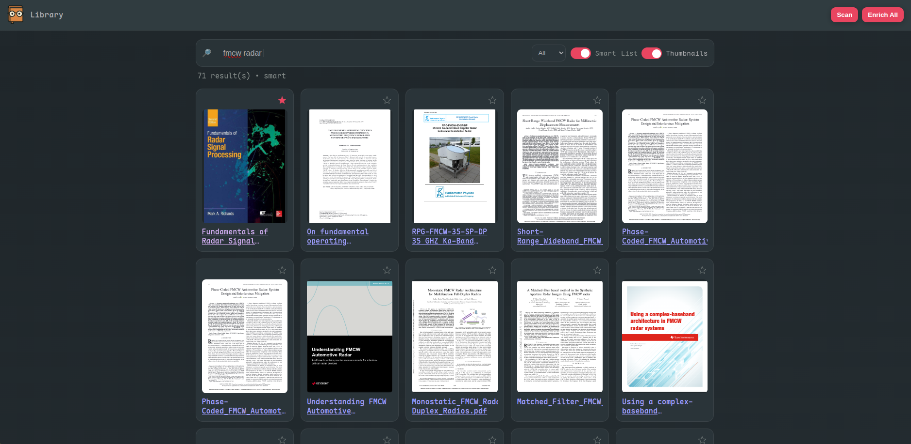
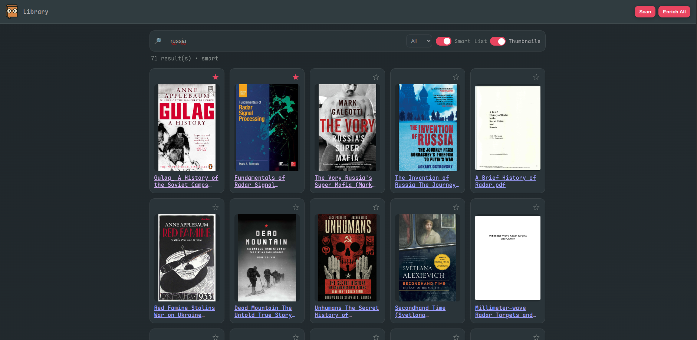

# Library

Local PDF, EPUB, etc. library.

## Prerequisites

- Docker (with compose)

## Setup

- Edit `docker-compose.yml` and update the `volumes` mapping to point to your documents directory, for example:
  - `- /path/to/your/books:/content:ro`
    The app scans `/content` inside the container.

## Start

- Build and start in the background:
  - `docker compose up --build -d`
- Open the UI:
  - http://localhost:8080

## Behavior

- The database and config persist in the `library_data` volume mounted at `/data`.
- Initial scan begins automatically (`LIBINDEX_AUTOSCAN=1`). Use the “Scan” button in the UI to rescan later.
- PDF/EPUB viewers and thumbnails are bundled offline (no Internet required).

## Operations

- View logs: `docker compose logs -f library`
- Rebuild after updates: `docker compose up --build -d`
- Stop: `docker compose down`

## Optional

- To disable auto-scan on startup, set `LIBINDEX_AUTOSCAN=0` in `docker-compose.yml`.
